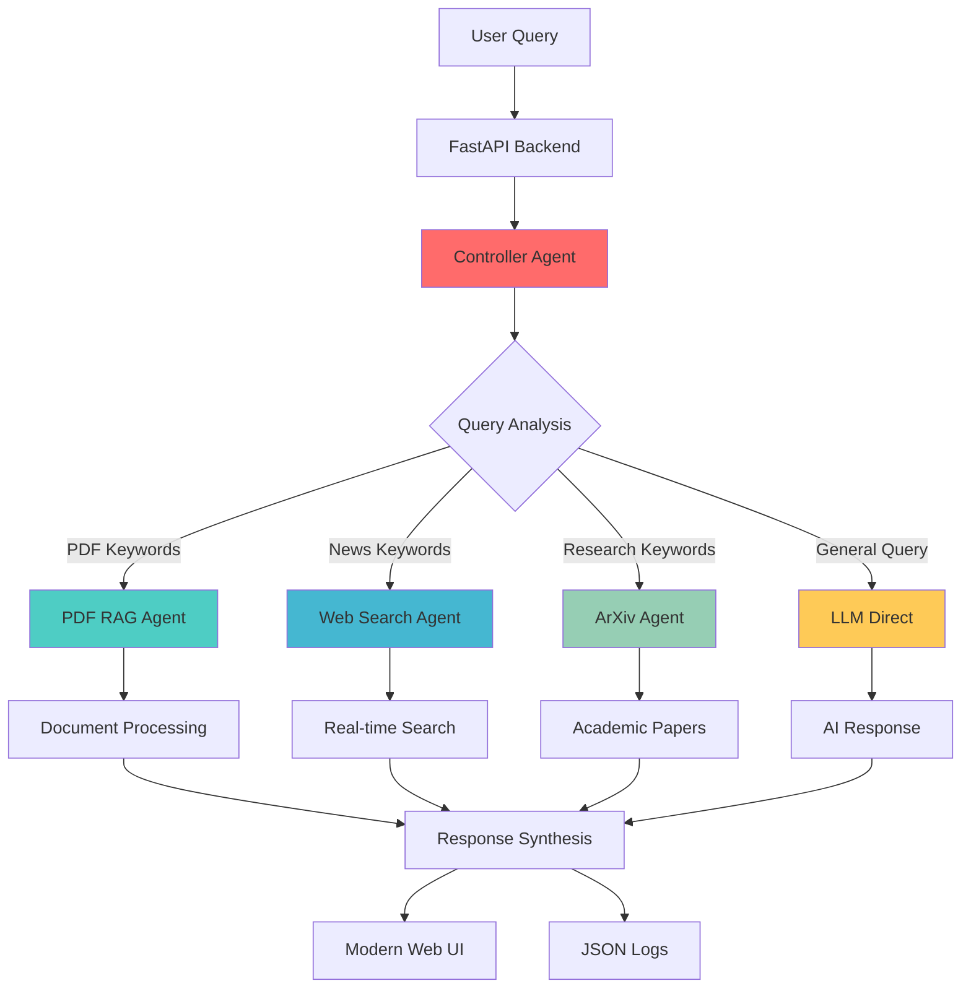

# Multi-Agentic System

🚀 **Intelligent Multi-Agent AI Platform** - A sophisticated question-answering system that intelligently routes queries to specialized AI agents based on content analysis and user intent.

[](https://render.com/deploy)
[](https://fastapi.tiangolo.com)
[](https://python.org)
[](https://opensource.org/licenses/MIT)

## 🌟 Project Overview

The Multi-Agentic System is an advanced AI orchestration platform that automatically determines the best approach to answer user queries by intelligently routing to specialized agents:

- **📄 PDF RAG Agent**: Extracts and analyzes information from uploaded documents
- **🌐 Web Search Agent**: Fetches real-time information from the internet  
- **📚 ArXiv Agent**: Searches academic papers and research publications
- **🧠 Controller Agent**: Orchestrates multi-agent workflows and synthesizes responses

### Key Features

✅ **Smart Query Routing** - Automatically determines which agents to invoke based on query analysis  
✅ **Multi-Modal Processing** - Handles text queries, PDF documents, and web searches seamlessly  
✅ **Real-Time Web Search** - DuckDuckGo integration with domain-specific enhancement  
✅ **Document Intelligence** - Advanced PDF parsing with chunking and similarity search  
✅ **Modern UI** - Responsive glassmorphism design with agent status indicators  
✅ **Comprehensive Logging** - Full reasoning traces and decision rationale tracking  
✅ **Production Ready** - Deployed on Render with health checks and monitoring  

## 🏗️ System Architecture



## 🤖 Agent Capabilities

### 1. Controller Agent (🧠 Orchestrator)
- **Smart Routing**: Rule-based + LLM-assisted query analysis
- **Multi-Provider Support**: Groq, OpenAI, Google Gemini, Ollama, Echo fallback
- **Decision Logging**: Complete reasoning traces with timestamps
- **Response Synthesis**: Combines outputs from multiple agents

### 2. PDF RAG Agent (📄 Document Intelligence)  
- **Document Processing**: PyMuPDF/pypdf extraction with fallback
- **Intelligent Chunking**: 800-character chunks with 120-character overlap
- **Multiple Retrieval Modes**: TF-IDF cosine similarity, embeddings (sentence-transformers)
- **Vector Storage**: Optional Chroma backend support

### 3. Web Search Agent (🌐 Real-time Information)
- **Live Search**: DuckDuckGo integration with SerpAPI fallback
- **Domain Enhancement**: Query optimization for business, sports, tech topics
- **Source Verification**: Credible source filtering and ranking
- **LLM Summarization**: Intelligent content synthesis

### 4. ArXiv Agent (📚 Academic Research)
- **Research Papers**: Direct ArXiv API integration
- **Retry Logic**: Robust error handling and fallback mechanisms  
- **Content Summarization**: AI-powered paper abstracts

## 🚀 Quick Start

### Prerequisites
- Python 3.11+
- Virtual environment (recommended)
- Groq API key (primary LLM provider)

### 1. Clone Repository
```bash
git clone https://github.com/Sagar-Bawankule/Multi_Agentic_System.git
cd Multi_Agentic_System
```

### 2. Setup Environment
```bash
# Create virtual environment
python -m venv .venv

# Activate virtual environment
# Windows:
.\.venv\Scripts\Activate.ps1
# Linux/Mac:
source .venv/bin/activate

# Install dependencies
pip install -r requirements.txt
```

### 3. Configure Environment Variables
```bash
# Copy example environment file
cp .env.example .env

# Edit .env with your API keys
GROQ_API_KEY=your_groq_api_key_here
OPENAI_API_KEY=your_openai_key_here  # Optional
SERPAPI_KEY=your_serpapi_key_here    # Optional
```

### 4. Run Application
```bash
# Start FastAPI server
uvicorn app:app --host 0.0.0.0 --port 8000

# Alternative: Use custom start script
python run_app.py
```

### 5. Access Application
- **Web Interface**: http://localhost:8000
- **API Documentation**: http://localhost:8000/docs  
- **Health Check**: http://localhost:8000/health

## 📁 Project Structure

```
Multi-Agentic-System/
├── 🚀 app.py                    # FastAPI application entry point
├── 📁 agents/                   # AI Agent implementations
│   ├── controller_agent.py      # Main orchestrator and query router
│   ├── pdf_rag_agent.py        # Document processing and RAG
│   ├── web_search_agent.py     # Real-time web search
│   └── arxiv_agent.py          # Academic paper search
├── 🎨 frontend/                 # Modern web interface
│   └── index.html              # Glassmorphism UI with agent badges
├── 📊 logs/                     # Decision trace logs (JSON)
├── 📄 sample_pdfs/             # Example documents for testing
├── 🗄️ vector_store/            # Document embeddings storage
├── 🧪 tests/                   # Comprehensive test suite
├── 🔧 requirements.txt         # Python dependencies
├── 🐳 Dockerfile               # Container deployment config
├── ⚙️ render.yaml              # Render deployment configuration
├── 📋 Procfile                 # Process management
├── 🌍 .env.example             # Environment variables template
└── 📚 DEPLOYMENT.md            # Deployment instructions
```

## 🔧 Dependencies

### Core Framework
- **FastAPI 0.110.0** - High-performance web framework
- **Uvicorn 0.29.0** - ASGI server implementation
- **Python 3.11+** - Latest Python features and performance

### AI & Machine Learning
- **Groq 0.32.0** - Primary LLM provider (Llama 3.1)
- **OpenAI 1.35.10** - GPT models support
- **scikit-learn 1.5.0** - TF-IDF vectorization and similarity
- **sentence-transformers** - Optional embeddings (if `RAG_EMBEDDINGS=1`)

### Document Processing
- **pypdf 4.3.1** - PDF text extraction
- **python-multipart 0.0.6** - File upload handling

### Web & Networking
- **requests 2.31.0** - HTTP client for web searches
- **httpx 0.28.1** - Async HTTP client
- **ddgs 9.6.0** - DuckDuckGo search integration
- **serpapi 0.1.5** - Enhanced search capabilities (optional)

### Development & Testing
- **pytest 8.2.2** - Testing framework
- **python-dotenv 1.0.1** - Environment variable management

## 🔌 API Endpoints

| Endpoint | Method | Description |
|----------|--------|-------------|
| `/` | GET | 🎨 Modern web interface |
| `/ask` | POST | 💬 Main query processing endpoint |
| `/upload_pdf` | POST | 📄 PDF document upload and processing |
| `/logs` | GET | 📊 Recent decision logs and traces |
| `/health` | GET | ❤️ Basic health check |
| `/health/extended` | GET | 🔍 Detailed system metrics |
| `/controller/decide` | GET | 🧠 Dry-run query routing (no execution) |
| `/agents/status` | GET | 📋 Agent diagnostic information |
| `/pdf/stats` | GET | 📈 RAG system statistics |
| `/pdf/reset` | POST | 🗑️ Clear document vector store |
| `/pdf/generate_from_text` | POST | 📝 Create synthetic PDF for testing |

## 📊 Expected Outputs

### Query Processing Flow
1. **Input**: User query via web interface or API
2. **Analysis**: Controller agent analyzes query intent and keywords
3. **Routing**: Automatically selects appropriate agents:
   - PDF keywords → RAG Agent
   - News keywords → Web Search Agent  
   - Research keywords → ArXiv Agent
   - General queries → Direct LLM
4. **Processing**: Selected agents process the query in parallel
5. **Synthesis**: Controller combines and synthesizes agent responses
6. **Output**: Comprehensive answer with sources and reasoning traces

### Sample Outputs

**PDF Query Example**:
```json
{
  "answer": "Based on the uploaded document, the key findings are...",
  "agents_invoked": ["pdf_rag"],
  "decision_rationale": "Query contains 'document' keyword, routing to PDF RAG",
  "sources": [
    {"filename": "report.pdf", "chunk": 0, "score": 0.95}
  ],
  "reasoning_trace": "PDF analysis shows relevant content in section 2..."
}
```

**Web Search Example**:
```json
{
  "answer": "Latest AI developments include breakthrough in...",
  "agents_invoked": ["web_search"],
  "decision_rationale": "Query contains 'latest' keyword, routing to web search",
  "sources": [
    {"url": "https://example.com", "title": "AI Breakthrough", "score": 0.92}
  ],
  "web_search_summary": "Recent developments in artificial intelligence..."
}
```

**Multi-Agent Example**:
```json
{
  "answer": "Combining research papers and current news...",
  "agents_invoked": ["arxiv", "web_search"],
  "decision_rationale": "Query matches both research and news patterns",
  "arxiv_papers": [...],
  "web_sources": [...],
  "synthesis": "Cross-referencing academic research with current developments..."
}
```

## ⚙️ Configuration

### Environment Variables (.env)
```bash
# Core LLM Configuration (Required)
LLM_PROVIDER=groq                    # Primary: groq, openai, gemini
GROQ_API_KEY=your_groq_key_here
GROQ_MODEL=llama-3.1-8b-instant

# Optional LLM Providers
OPENAI_API_KEY=sk-your_openai_key
GEMINI_API_KEY=your_gemini_key

# Web Search Enhancement (Optional)
SERPAPI_KEY=your_serpapi_key         # Enhanced search capabilities

# RAG Configuration (Advanced)
RAG_EMBEDDINGS=1                     # Enable embeddings (0=TF-IDF, 1=embeddings)
RAG_EMBED_MODEL=all-MiniLM-L6-v2    # Sentence transformer model
RAG_BACKEND=tf                       # Vector backend: tf or chroma

# Server Configuration
PORT=8000                            # Application port
PYTHONPATH=/app                      # Python path for imports
```

## 🧪 Testing

### Run Test Suite
```bash
# Run all tests
pytest -v

# Run specific test categories
pytest tests/test_agents.py -v
pytest tests/test_api.py -v

# Check test coverage
pytest --cov=agents --cov-report=html
```

### Manual Testing
```bash
# Health check
curl http://localhost:8000/health

# Query endpoint
curl -X POST "http://localhost:8000/ask" \
     -H "Content-Type: application/x-www-form-urlencoded" \
     -d "query=What are the latest AI developments?"

# PDF upload
curl -X POST "http://localhost:8000/upload_pdf" \
     -F "file=@sample.pdf"
```

## 🔒 Security & Privacy

### Data Handling
- **No Personal Data Storage**: Queries and responses are not permanently stored
- **Temporary Processing**: Documents processed in memory, cleared after session
- **API Key Security**: All API keys stored in environment variables (`.env`)
- **Local Storage Only**: Vector embeddings stored locally, not shared externally

### Production Security
- **Environment Isolation**: API keys never committed to repository
- **HTTPS Required**: All production deployments use SSL/TLS
- **Rate Limiting**: Optional rate limiting for production use
- **Input Validation**: All user inputs sanitized and validated

## 🌍 Deployment

### Render (Recommended)
[](https://render.com/deploy)

```bash
# Automatic deployment via GitHub
1. Connect repository to Render
2. Add environment variables in dashboard
3. Deploy automatically with every commit
```

### Docker Deployment
```bash
# Build image
docker build -t multi-agentic-system .

# Run container
docker run -p 8000:8000 \
  -e GROQ_API_KEY=your_key_here \
  multi-agentic-system
```

### Local Development
```bash
# Development server with auto-reload
uvicorn app:app --reload --host 0.0.0.0 --port 8000

# Production server
python app.py
```

## 🚫 Limitations & Future Work

### Current Limitations
- **Query Complexity**: Complex multi-step reasoning may require manual query refinement
- **Context Length**: Limited by individual LLM context windows (8K-32K tokens)
- **Real-time Updates**: Web search results cached briefly, may not reflect immediate changes
- **Language Support**: Optimized for English queries, limited multilingual support
- **Offline Mode**: Requires internet connection for LLM and web search functionality

### Future Enhancements
- **🔄 Conversation Memory**: Multi-turn dialogue with context retention
- **📊 Advanced Analytics**: Query pattern analysis and optimization
- **🌐 Multi-language Support**: Enhanced support for non-English queries
- **🔗 API Integrations**: Additional data sources (Twitter, Reddit, News APIs)
- **🧠 Improved Reasoning**: Chain-of-thought and tree-of-thought reasoning
- **📱 Mobile App**: Native mobile applications for iOS and Android
- **🔐 User Authentication**: Multi-tenant support with user accounts
- **📈 Scaling**: Distributed agent processing and load balancing

## 🤝 Contributing

We welcome contributions! Please see our [Contributing Guidelines](CONTRIBUTING.md) for details.

### Development Setup
```bash
# Clone repository
git clone https://github.com/Sagar-Bawankule/Multi_Agentic_System.git

# Setup development environment
pip install -r requirements.txt
pip install -r requirements-dev.txt  # Development dependencies

# Run tests before committing
pytest
```

## 📄 License

This project is licensed under the MIT License - see the [LICENSE](LICENSE) file for details.

## 🙏 Acknowledgments

- **FastAPI** - High-performance web framework
- **Groq** - Lightning-fast LLM inference
- **OpenAI** - Advanced language models
- **DuckDuckGo** - Privacy-focused search engine
- **ArXiv** - Open access research papers
- **Render** - Seamless deployment platform

---

## 📞 Support

- **Issues**: [GitHub Issues](https://github.com/Sagar-Bawankule/Multi_Agentic_System/issues)
- **Discussions**: [GitHub Discussions](https://github.com/Sagar-Bawankule/Multi_Agentic_System/discussions)
- **Documentation**: [Project Wiki](https://github.com/Sagar-Bawankule/Multi_Agentic_System/wiki)

**⭐ Star this repository if you find it helpful!**
| `/health/extended` | GET | Extended metrics |
| `/controller/decide` | GET | Dry-run routing decision |
| `/agents/status` | GET | Agent diagnostics |
| `/pdf/stats` | GET | RAG stats (chunks, backend) |
| `/pdf/reset` | POST | Clear RAG store |
| `/pdf/generate_from_text` | POST (form) | Create + ingest synthetic PDF |

## PDF RAG
Extraction priority: PyMuPDF → pypdf → heuristic fallback.
Chunking: sliding window (size 800, overlap 120).
Retrieval:
- Default TF cosine token frequency
- Embeddings (if `RAG_EMBEDDINGS=1`) using sentence-transformers
- Optional Chroma backend (in-memory) if `RAG_BACKEND=chroma` + embeddings enabled

Sources list each chunk: source filename, chunk index, preview, score.

## LLM Integration
`call_llm_api` supports: Groq, Gemini, OpenAI, custom (Ollama), echo fallback. Errors degrade gracefully to echo. Provide only needed keys. Custom expects an Ollama-compatible `/api/chat` JSON interface.

## Deployment

### Quick Deploy to Render
[](https://render.com/deploy)

1. **Connect Repository**: Link your GitHub repository to Render
2. **Configure Service**:
   ```
   Build Command: pip install -r requirements.txt
   Start Command: uvicorn app:app --host 0.0.0.0 --port $PORT
   ```
3. **Set Environment Variables** in Render dashboard:
   ```
   GROQ_API_KEY=your_groq_api_key_here
   OPENAI_API_KEY=your_openai_key (optional)
   LLM_PROVIDER=groq
   ```
4. **Deploy**: Render will automatically build and deploy your app

### Deploy to HuggingFace Spaces
1. Create new Space with Docker SDK
2. Upload project files
3. Use `Dockerfile.huggingface` for HF-specific configuration
4. Set environment variables in Space settings

### Alternative: Manual Deploy
See detailed instructions in [DEPLOYMENT.md](./DEPLOYMENT.md) for:
- Step-by-step Render deployment
- HuggingFace Spaces deployment  
- Environment configuration
- Troubleshooting guide

## Security & Privacy
- PDF size limited to 5MB.
- Only PDFs accepted.
- Files stored locally in `sample_pdfs/`; clear directory for sensitive data.
- Add auth (e.g., API key header) for production.

## Security & Privacy
- PDF validation: extension + max 5MB.
- Local storage only; delete `sample_pdfs/` to purge.
- No PII detection yet—recommend external sanitizer for production.
- Add auth middleware (e.g., header token) for multi-tenant use.

## Limitations
- Without real LLM keys, synthesis quality is limited (echo/custom fallback).
- DuckDuckGo HTML parsing brittle if markup changes.
- ArXiv summarization concise but shallow; could add embedding rerank pipeline.
- Chroma not persisted across restarts (in-memory client).

## Roadmap Ideas
- Streaming token responses.
- FAISS index persistence layer or lightweight sqlite-backed Chroma.
- Rate limiting & API key auth.
- Hybrid retrieval (BM25 + embeddings).

## Roadmap Ideas
- Add conversation history & memory.
- Integrate better summarization models.
- Support streaming responses.
- Add user authentication & rate limiting.

## License
MIT (adjust as desired).
